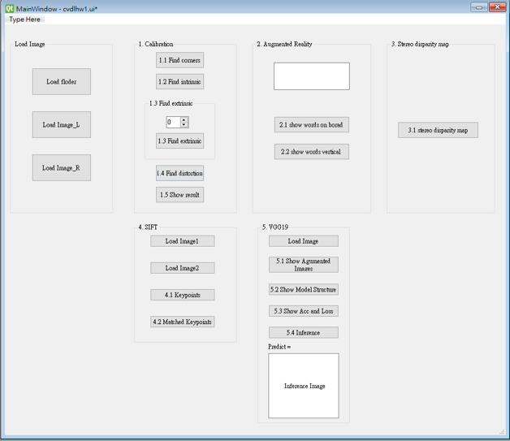

* **hw1.ui** for QT Designer
* use `pyuic5 hw1.ui -o hw1_ui.py` to make **hw1_ui.py**
* **main** contain Q1-Q5 and use **hw1_ui.py** to be user interface
* **model** for training
* **record** contain model model parameter optimization

User interface is as shown below
 

 

Q1. Corner Detection 
>Find and draw the corners on the chessboard for each image
>Find the Intrinsic matrix
>Find the Extrinsic Matrix
>Find the Distortion Matrix
>Show the Undistorted Result
 

Q2. Augmented Reality
>Show words on board
>Show words on board vertically
 

Q3. Stereo Disparity Map
>Draw Stereo Disparity Map
 

Q4. SIFT
>Based on SIFT algorithm, find  key points
>Draw the matched feature points between two image
 

Q5.Training a CIFAR10 Classifier Using VGG19 with BN
>Accuracy up to 90%

