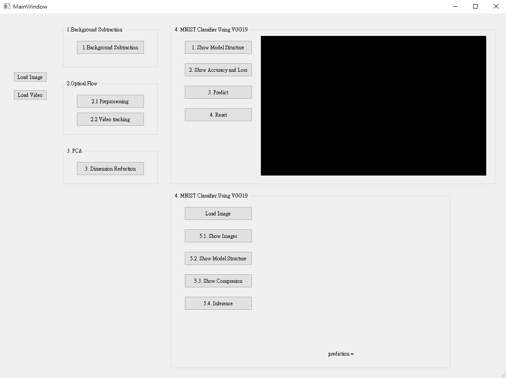

* **hw2.ui** for QT Designer
* use `pyuic5 hw2.ui -o hw2_ui.py` to make **hw2_ui.py**
* **main** contain Q1-Q5 and use **hw2_ui.py** to be user interface
* **vgg_model** and ***resnet_model** for training
* **record.txt** contain model model parameter optimization

User interface is as shown below
 

 

Q1. Background Subtraction 
>Remove background and show the resule
 

Q2. Optical Flow
>Display the trajectory of the tracking point throughout the video
 

Q3. PCA – Dimension Reduction
>Using PCA (Principal components analysis) to do dimension reduction on given image
 

Q4. Training a MNIST Classifier Using VGG19 with BN
>Make predictions for users' handwritten text.
>Accuracy up to 99%
 

Q5.Train a Cat-Dog Classifier Using ResNet50
>Learn to fine-tune model architecture for binary classification
>Accuracy up to 99%

